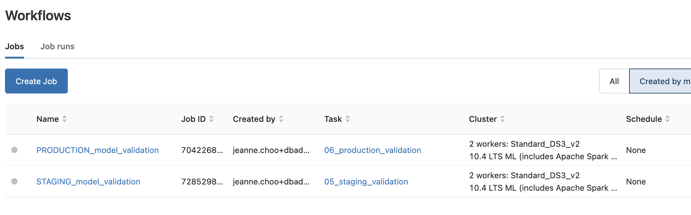
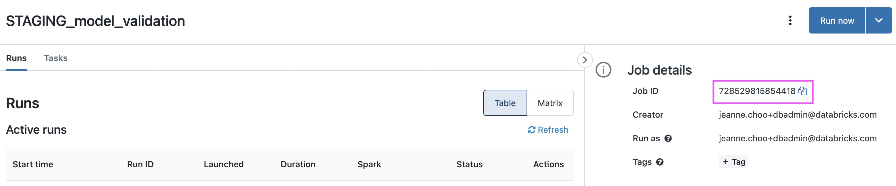
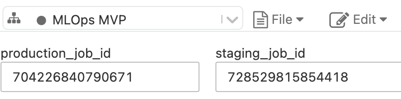

Repository structure 

```
|- 00a_lakehouse_etl.py # example of how to ingest data into bronze tables
|- 01_feature_engineering.py # example of how to save features into Feature Store for reuse and lineage tracking
|- 02_automl_baseline.py # training a baseline model with AutoML 
|- 03_webhooks_setup.py  # start here if you already have a model to be productionized
|- 04_from_exp_to_registry.py
|- 05_staging_validation.py. # testing notebook for staging
|- 06_production_validation.py. # testing notebook for production 
|- 07_retrain_churn_automl.py
|- 08_staging_batch_inference.py
Shared_Include.py
```

# 03_webhooks_setup.py 
1. Create two workflows using the Jobs UI and the `05_staging_validation.py` and `06_production_validation.py` files. These notebooks include testing code that will run automatically when a transition request is made to move a model in Mlflow Model Registry from `None` to `Staging` 


2. Copy the Job ID of these two workflows


3. Input the Job IDs into the widgets at the top of the `03-webhooks_setup.py` file


4. Click Run All at the top of the notebook.   
The `03_webhooks_setup.py` will setup two Jobs Webhooks that will trigger the workflows `05_staging_validation.py` and `06_production_validation.py` that we setup earlier. We can also setup Slack notifications although this is not done in the current notebook. 
